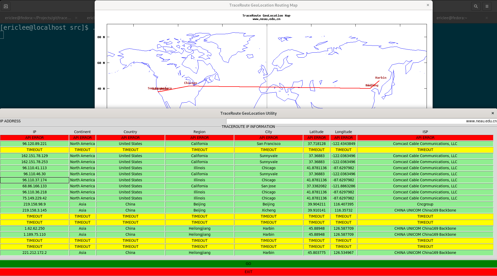

# TraceRoute GeoLocation Utility

## Introduction

TraceRoute GeoLocation Utility is a GUI program to run `traceroute` program and plotting the routing map via [GNUPlot](http://www.gnuplot.info/). The IP WHOIS information source is from [IPWHOIS](https://ipwhois.io/). The program is written by Tcl language.

## Requirements

[Tcl](https://core.tcl-lang.org/tcl)

[Tk](https://core.tcl-lang.org/tk)

[Tcllib](https://www.tcl.tk/software/tcllib/)

The current code is tested and passed in the following environment:

* Operating System: Fedora 34 - Linux
* Tcl: tcl-8.6.10-5
* TclLib: tcllib-1.19-6
* Tk: tk-8.6.10-6
* traceroute: 2.1.0
* GNUPlot: 5.2 patchlevel 8

## Usage

Before running this utility, user needs to check following variables in `traceroute-geolocation.tcl` to make sure `traceroute` / `gnuplot` binaries are pointing to correct paths. Also, to plot the routing map, it needs to use a world map data points file from GNUPlot. The file can be downloaded [here](https://github.com/gnuplot/gnuplot/blob/master/demo/world.dat). 

Here are default variables settings:

```tcl
# define initial variables
set traceroute_bin "/usr/bin/traceroute"
set gnuplot_bin "/usr/bin/gnuplot"
set world_map_data "/usr/share/doc/gnuplot-doc/demo/world.dat"
set traceroute_geolocation_gnuplot "traceroute-geolocation.gnuplot"
```

The input blank can accept both IPv4 address and FQDN hostname. It does not support multiple entries. I didn't test IPv6 address yet, it's up to the compatibility of `traceroute`.

It's very normal that ISP routers use ICMP protocol rate-limiting to reduce ingress traffic. If `traceroute` encounters timeout, the utility will print a **TIMEOUT** message in the whole row. 

If due to the IP range or other reasons the IPWHOIS API could not get correct information, the utility will print a **API ERROR** in the whole row.

Once the whole TraceRoute process is done, a geolocation data points file will be created under user's home directory.

The file `traceroute-geolocation.gnuplot` is a GNUPlot script to generate graphs. By default, it will create 2 images in PNG and SVG formats with `1280x960` size under user's home directory. I suggest user puts `traceroute-geolocation.tcl` and `traceroute-geolocation.gnuplot` in the same directory.

## Known Issues

1. I am using a lightweight solution to plot worldmap so it may seem very ugly. If I can find any other local and open sourced map solution I would improve this part without any doubt. Please bear with me.
2. I didn't implement the image shrinking feature yet when displaying the routing map. It's a bit difficult but I would add this feature in a future version.

## Screenshots

### Routing Map to My University



## TODO

1. Add image shrinking feature when displaying map.
